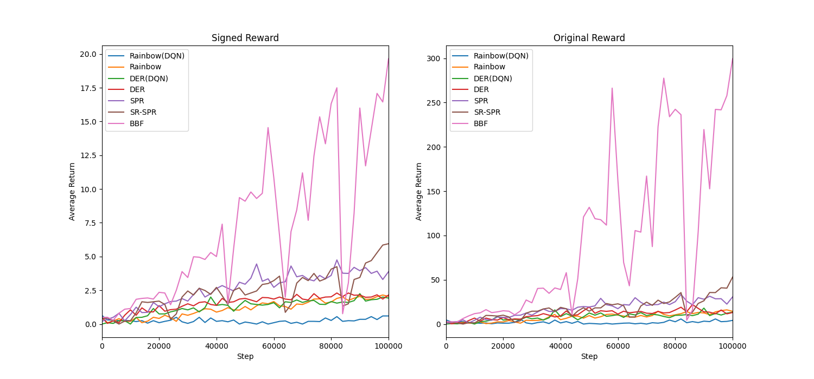

# Breakout-v4 in 100K step

## DQNs

## Max Reward 
| **Algorithm** | Signed Reward | Original Reward |
| -------- | ----- | ----- |
| Rainbow(DQN)  | 0.72 | 5.7 |
| Rainbow  | 3.20 | 22.25 |
| DER(DQN) | 2.45 | 14.67 |
| DER      | 2.79 | 20.67 |
| SPR      | 6.29 | 53.50 |
| SR-SPR   | 6.33 | 135.0 |
| BBF      | **16.4** | **339.0** |

## Algorithm Specifications
- **Rainbow(DQN)**: Rainbow DQN without C51, replay ratio (rr) = 0.25
- **Rainbow**: Standard Rainbow DQN, rr = 0.25
- **DER**: Data Efficient Rainbow, rr = 2
- **DER(DQN)**: Data Efficient version of basic DQN
- Note: Simple Rainbow DQN was not scaled by the replay ratio factor.