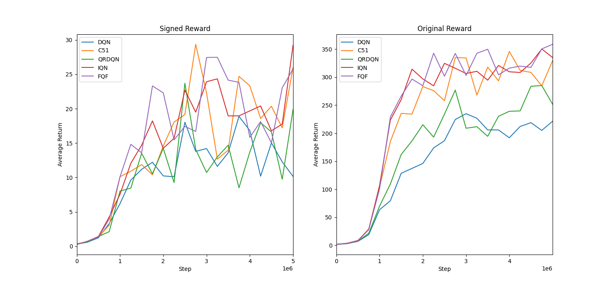

# Breakout-v4 in 5M step

## DQNs

## M-DQNs

## Max Reward 
| **Algorithm** | Signed Reward | Original Reward |
| -------- | ----- | ----- |
| DQN  | 18.89 | 234.85 |
| C51  | 29.36 | 345.93 |
| QRDQN| 23.36 | 285.11 |
| IQN  | 29.22 | 350.33 |
| FQF  | 27.48 | 358.67 |