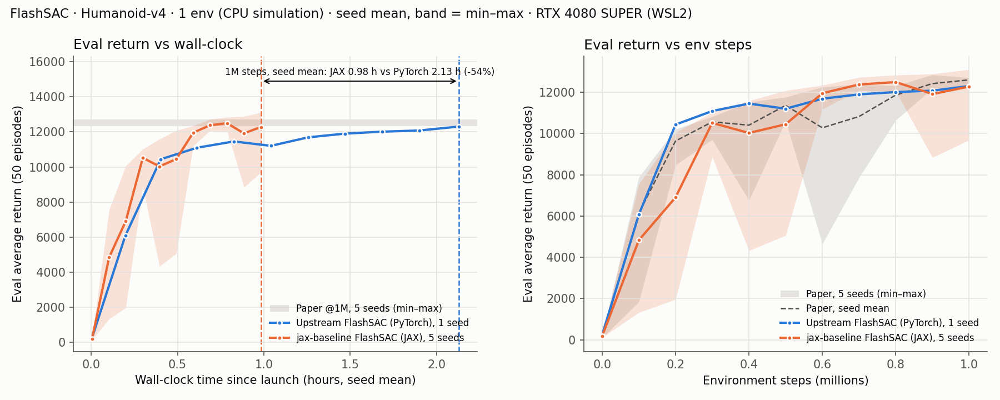
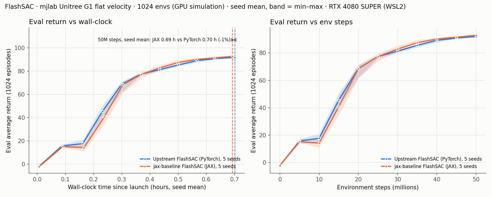

# FlashSAC

jax-baseline's FlashSAC (JAX/Flax) against the reference PyTorch implementation
([Holiday-Robot/FlashSAC](https://github.com/Holiday-Robot/FlashSAC/tree/87edc9061150ae9e962dd84e6544e27a1554b3ab)).
The comparison covers two regimes: a CPU-simulated single environment (Gym MuJoCo Humanoid-v4)
and a GPU-simulated batch of 1024 environments (mjlab Unitree G1).

The reference has no mjlab support, so the mjlab port was written for this comparison.
It lives on the [`mjlab-port`](https://github.com/tinker495/FlashSAC/tree/mjlab-port) branch of the fork [tinker495/FlashSAC](https://github.com/tinker495/FlashSAC), at commit [`362a6a2`](https://github.com/tinker495/FlashSAC/commit/362a6a26dbaa8737d50f76c6039e15c7605b8c3a).
That commit adds only the mjlab environment on top of `87edc906`. Every upstream run on this page uses it, Humanoid included.

On mjlab both implementations run seeds 0–4. On Humanoid, JAX runs seeds 0–4 and upstream runs seed 0 only, because each upstream run takes about 2 h. Upstream always runs with `torch.compile`. AMP is on for mjlab and off for Humanoid, as each upstream recipe sets it. On Humanoid, AMP on measured about 4% slower.

<!-- BEGIN generated:summary -->

- Humanoid-v4, 1M steps: JAX 0.98 h vs PyTorch 2.13 h (-54%). Seeds finished: PyTorch 1/1, JAX 5/5.
- mjlab G1 flat velocity, 50M steps: JAX 0.69 h vs PyTorch 0.70 h (-1%). Seeds finished: PyTorch 5/5, JAX 5/5.

<!-- END generated:summary -->

## Humanoid-v4 (Gym MuJoCo, CPU simulation, 1 environment)



<!-- BEGIN generated:humanoid -->

| Implementation              | Seeds | Wall-clock to 1M steps | Train throughput (env steps/s) | Time to 11,345 (90% of paper) | Final eval @1M                | Best eval    |
| --------------------------- | ----- | ---------------------- | ------------------------------ | ----------------------------- | ----------------------------- | ------------ |
| Upstream FlashSAC (PyTorch) | 1/1   | 2.13 h                 | 139                            | 0.83 h                        | 12,308                        | 12,308       |
| jax-baseline FlashSAC (JAX) | 5/5   | 0.98 ± 0.04 h          | 307 ± 9                        | 0.45 ± 0.09 h                 | 12,282 ± 1,463 (9,685–13,108) | 12,823 ± 300 |
| Paper (5 seeds)             | –     | –                      | –                              | –                             | 12,606 (12,329–12,713)        | –            |

Seed-mean wall-clock to 1M steps: JAX 0.98 h vs PyTorch 2.13 h (-54%).

<!-- END generated:humanoid -->

- JAX seed 0 reproduced all 11 evaluations of an earlier run at commit `6f0279f6` exactly, including the dip to 8,844 at 900k steps. On this machine the JAX Humanoid run is deterministic for a given seed.

- Three of the five JAX seeds have an evaluation far below their neighbors:

  - Seed 0 at 900k steps (8,844), seed 1 at 500k (5,057), and seed 2 at 400k (4,324) and 1M (9,685). Seeds 3 and 4 have none.
  - Seed 2's drop falls on the final evaluation, so it pulls down the final-eval mean. The best-eval column is not affected.
  - The paper's 5-seed band shows drops of the same size, down to 4.6k at 600k. The single upstream seed has none.

- Setup:

  - JAX seeds 0–4 and upstream seed 0, 1M env steps, batch 512, one update per env step, learning starts at 10k steps.
  - Evaluation: 50 episodes every 100k steps.
  - Upstream uses its `scripts/run_mujoco.sh` recipe with `torch.compile` (`max-autotune`, torch 2.9.1) and AMP off, as the recipe sets it.
  - AMP on was about 4% slower here: 135.6 against 141.1 env steps/s over steps 20k–420k of seed 0, both measured on the same day.
    - With batch 512 the update is limited by per-call latency, not compute.
    - AMP's GradScaler reads its overflow flag on the host at every optimizer step.
  - JAX uses [`experiments/configs/mujoco/flashsac_humanoid.yaml`](../experiments/configs/mujoco/flashsac_humanoid.yaml).

- Wall-clock is measured from launch to the logged final evaluation.

- Throughput is summed over the evaluation-free intervals after 20k steps.

- Time to threshold is computed per seed and then averaged. A seed that never reaches the threshold is left out, and the count of seeds that did is shown.

## mjlab Unitree G1 flat velocity (GPU simulation, 1024 environments)



<!-- BEGIN generated:mjlab -->

| Implementation              | Seeds | Wall-clock to 50M steps | Train throughput (env steps/s) | Time to 83.6 (90% of the best seed-mean final) | Final eval @50M        | Best eval  |
| --------------------------- | ----- | ----------------------- | ------------------------------ | ---------------------------------------------- | ---------------------- | ---------- |
| Upstream FlashSAC (PyTorch) | 5/5   | 0.70 ± 0.01 h           | 22,585 ± 227                   | 0.50 ± 0.01 h                                  | 91.9 ± 0.3 (91.5–92.3) | 91.9 ± 0.3 |
| jax-baseline FlashSAC (JAX) | 5/5   | 0.69 ± 0.03 h           | 22,872 ± 891                   | 0.49 ± 0.04 h                                  | 92.9 ± 0.5 (92.5–93.6) | 92.9 ± 0.5 |

Seed-mean wall-clock to 50M steps: JAX 0.69 h vs PyTorch 0.70 h (-1%).

<!-- END generated:mjlab -->

- Results over 5 seeds each:

  - Wall-clock is at parity. JAX seed 0 took 0.75 h and seeds 1–4 took 0.67–0.69 h.
    - About 47 s of seed 0's extra time was compilation (see Reproduce).
    - The rest came from lower throughput in that run: 21,336 env steps/s, against 22,857–23,463 for the other seeds. The cause is unknown.
  - JAX ends about 1 point higher (92.9 vs 91.9), and the final values of the two implementations do not overlap. Upstream's final value is the mean of two evaluations (see below).
  - The curves over env steps cross:
    - Upstream's seed mean leads at 10–15M steps, by 3.5–4.8.
    - The means meet at 20–25M, and JAX leads from 30M: +2.0 at 35M and about +1 at 50M.
    - The min–max bands overlap at every evaluation up to 45M.
  - The previous single-seed run, with actor observations only, had JAX 10% faster (0.68 h vs 0.75 h). That lead is gone because upstream got faster:
    - JAX seeds 1–4 run at the same throughput as that run (23,257 vs 23,201 env steps/s).
    - Upstream is 7.7% faster (20,978 → 22,585), even though it now also builds both observation groups and stores 210-dim observations.
    - The cause is not identified. That run was on a different day and used an earlier revision of the port.

- Setup:

  - Task `Mjlab-Velocity-Flat-Unitree-G1`, 1024 environments, seeds 0–4, 50M env steps.
  - Two updates per vector step, batch 2048, 3-step returns, 5M-transition GPU replay.
  - Evaluation: 1024 episodes at step 0, about every 5M steps, and at the end.
    - JAX runs 11 evaluations.
    - Upstream runs 12, because its last periodic evaluation (49.99M) falls just before the final one. This adds about 20 s to its wall-clock.

- Observations are split between actor and critic, with the same inputs in both implementations:

  - The actor sees mjlab's `actor` group (99 dims, with observation noise).
  - The critic sees the `actor` group and the privileged `critic` group (99 + 111 = 210 dims). The `critic` group is noise-free and includes every actor term.
  - Upstream gets this layout from its IsaacLab wrapper, which concatenates the two groups and gives the actor only the leading slice. Its IsaacLab benchmark recipe (`scripts/run_isaaclab.sh`) runs with `asymmetric_observation=false`; this comparison turns it on.
  - JAX gets it with `--env_share_actor_obs`, which feeds the `actor` group to both networks. Without the flag, the JAX critic sees only the `critic` group (111 dims).

- Upstream: the port on the fork's [`mjlab-port`](https://github.com/tinker495/FlashSAC/tree/mjlab-port) branch (commit `362a6a2`), run with `torch.compile` (`max-autotune`) and AMP.

  - It adds `flash_rl/envs/mjlab.py`, which mirrors the reference's IsaacLab wrapper, and `configs/env/mjlab.yaml`.
  - Like that wrapper, the port uses the reset observation in place of the terminal observation at time-outs. The JAX adapter keeps the true terminal observation.
  - Upstream's last logged evaluation is the mean of its last two evaluations: the periodic one at 49.99M steps and the final one.
  - The port also follows the wrapper's reset protocol:
    - Every full reset randomizes the episode counters. Full resets happen at training start and at the end of each evaluation.
    - Each evaluation resets the 1024 training environments mid-episode. The transitions that span an evaluation, about 0.06% of the replay, link a pre-evaluation state to a reset state.
    - JAX starts all environments at step 0 and restores the training state after each evaluation.
  - Upstream logs each evaluation at its next logging boundary, about 20 s after it ran, so its time to threshold is late by that much.

- JAX: [`experiments/configs/mjlab/flashsac_mjlab_g1.yaml`](../experiments/configs/mjlab/flashsac_mjlab_g1.yaml) with `--set eval_eps=1024 --set env_share_actor_obs=true`.

- Reference run, not in the table: JAX with mjlab's default critic input (the `critic` group only, 111 dims), seed 0.

  - Final eval 92.3 at 50M steps, in 0.72 h (including about 47 s of compilation) at 22,007 env steps/s.
  - Eval curve at 0, 5M, …, 50M steps: −1.8, 14.8, 11.7, 31.9, 63.7, 74.9, 80.8, 84.1, 87.6, 91.9, 92.3.

- Throughput is summed over the evaluation-free intervals after 0.5M steps.

- The threshold is 90% of the higher seed-mean final evaluation of the two implementations.

## What makes the JAX version fast

The algorithm follows FlashSAC:

- Categorical twin critics (101 atoms) run as one vmapped ensemble.
- The encoders use BatchNorm and RMSNorm, with unit-norm weight projection.
- Exploration noise is repeated for a number of steps drawn from a zeta distribution.
- The reward divisor is `max(std(G), max|G| / G_max)`.
- The entropy target is set from `sigma_target`.

The speed comes from how each step is executed:

- **Compiled hot paths:**
  - Action selection, updates, reward normalization and replay batch preparation are each one compiled call.
  - Transfers between host and device are explicit; `--strict_transfers` fails on any implicit one.
- **Bulk updates** (`train_freq` and `gradient_steps` both 32): 32 updates run as one compiled scan every 32 env steps, keeping one update per env step.
  - The acting policy can be up to 32 updates behind, where upstream updates after every step.
- **Host-simulated envs:**
  - Actions are computed on the CPU backend from a mirror of the policy parameters. The mirror refreshes only when the parameters change. Under WSL2 this took 0.25 ms per step, against 2.0 ms for the GPU round trip.
  - Reward-normalizer records are queued and applied in one upload when the statistics are next read.
- **Device-simulated envs (mjlab):**
  - Observations reach JAX through DLPack without a host copy.
  - The flashbax GPU replay fuses sample → batch preparation → updates into one call, and record → episode statistics → add into another.
  - The update pulse is dispatched after the action and before the simulator step, so it overlaps the simulator. The replay rows and the reward normalizer it reads lag by one vector step.
  - Metrics are logged every 100 vector steps (`log_interval: 102400`).
- **Persistent compilation cache** (`~/.cache/jax_baselines/xla`): repeated runs skip recompiling the update step.

## Reproduce

```bash
uv run exp experiments/configs/mujoco/flashsac_humanoid.yaml --set seed=0 --set logger=tensorboard
uv run exp experiments/configs/mjlab/flashsac_mjlab_g1.yaml --set seed=0 --set eval_eps=1024 --set env_share_actor_obs=true --set logger=tensorboard
uv run python docs/make_plot_flashsac.py
```

- The first two commands run one seed each. Repeat them with `seed` from 0 to 4.
- The last command redraws both figures and the tables on this page from [`docs/csv/flashsac/`](csv/flashsac/).
- Upstream runs from a checkout of the fork's `mjlab-port` branch (`git clone -b mjlab-port https://github.com/tinker495/FlashSAC`). Use seeds 0–4 on mjlab and seed 0 on Humanoid:
  - mjlab needs mjlab 1.6.0 installed in the upstream environment.
  - The overrides are those of `scripts/run_mujoco.sh` and `scripts/run_isaaclab.sh`, except for the mjlab environment, the 5M replay and the observation split.
  - Video recording is off on Humanoid (`num_record_episodes=0`; the recipe records one episode). This only removes rendering time from upstream's wall-clock.

```bash
python train.py --config_name flashSAC_base --overrides seed=0 --overrides env=mujoco --overrides env.env_name=Humanoid-v4 --overrides num_env_steps=1_000_000 --overrides num_train_envs=1 --overrides num_eval_envs=1 --overrides num_record_envs=1 --overrides num_eval_episodes=50 --overrides num_record_episodes=0 --overrides agent.buffer_max_length=1_000_000 --overrides agent.buffer_min_length=10_000 --overrides agent.buffer_device_type=cpu --overrides agent.sample_batch_size=512 --overrides agent.use_amp=false --overrides updates_per_interaction_step=1 --overrides agent.asymmetric_observation=false --overrides gamma=0.99 --overrides n_step=1
python train.py --config_name flashSAC_base --overrides seed=0 --overrides env=mjlab --overrides env.env_name=Mjlab-Velocity-Flat-Unitree-G1 --overrides num_env_steps=50_000_896 --overrides num_train_envs=1024 --overrides num_eval_envs=null --overrides num_record_envs=null --overrides num_eval_episodes=1024 --overrides num_record_episodes=0 --overrides agent.buffer_max_length=5_000_000 --overrides agent.buffer_min_length=100_000 --overrides agent.buffer_device_type=cuda --overrides agent.sample_batch_size=2048 --overrides agent.use_amp=true --overrides updates_per_interaction_step=2 --overrides agent.asymmetric_observation=true --overrides gamma=0.99 --overrides n_step=3
```

- Leave `MUJOCO_GL` unset for mjlab runs. With `osmesa`, OSMesa loads the system LLVM, which conflicts with triton's bundled LLVM, and the run segfaults at startup.
- Hardware: RTX 4080 SUPER 16 GB and Ryzen 7 7800X3D, under WSL2. Each run is alone on the machine and pinned to CPUs 0–7.
- A short probe run of each configuration ran before the timed runs:
  - It warmed upstream's inductor cache.
  - JAX compiles the length of the learning-rate schedule into the update, so the shorter probe did not warm the JAX update cache.
  - The first timed JAX mjlab run compiled it, about 47 s. On Humanoid the effect was not visible.
- WSL2 makes GPU round trips expensive, which inflates the gain from acting on the CPU. On native Linux the Humanoid gap may be smaller.
